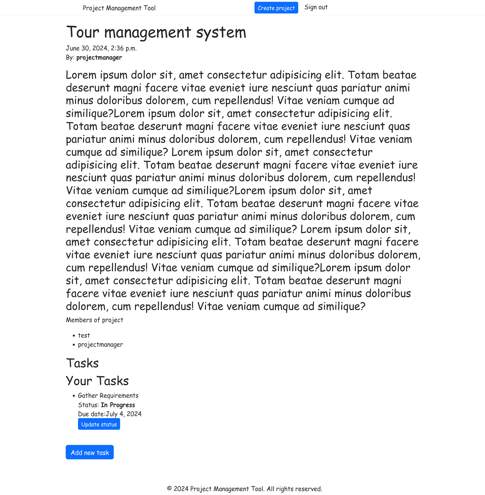

# ProjectManagement
## Setup 
git clone
```
git clone https://github.com/MdAshiqurRahmanZayed/ProjectManagement.git
```
```
cd ProjectManagement
```
create virtualenv and activate it.
```
python3 -m venv env
source env/bin/activate
```
Install dependency
```
pip install -r requirements.txt
```
migrate and create a superuser

```
python manage.py makemigrations
python manage.py migrate
python manage.py createsuperuser
```
run project
```
python manage.py runserver
```
Screenshot


